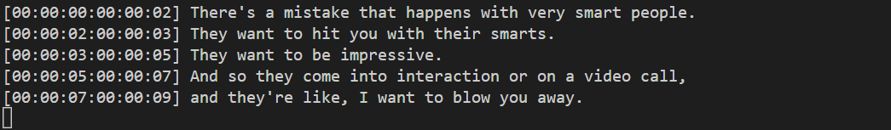
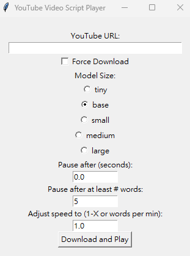

# Shadowing Practice Using Python
**Make your own VoiceTube.**
[Demo Video](https://www.youtube.com/watch?v=CEIoTZkU71c)
   
This is an applicaion using [whisper](https://github.com/openai/whisper).

GUI support   


## Installation
```
pip install -r requirements.txt
```

For cpu user:
1. Install torch first: `pip3 install torch torchvision torchaudio --extra-index-url https://download.pytorch.org/whl/cpu`

## Usage
GUI  
```
python gui.py
```

For Youtube link:
```
python main.py [--url YOUTUBE_URL] [--pause] [--force] [--model=base] [--words=5] [--speed=1.0]
```

For mp4 or mp3 files:
```
python mp4_to_mp3.py mp4filename.mp4  
python video2script.py mp4filename.mp4
python main.py [--pause] [--force] [--model=base] [--words=5] [--speed=1.0]
```

`--url`: Specify Youtube link. It is required for the first time use. If not set, play cached video. \
`--pause`: Manually set pause duration. If not set, It will equal the original sentence duration. \
`--force`: Re-processing video  \
`--model`: Choose Whisper model size: `tiny` | `base` | `small` | `medium` | `large`. Default `base` \
`--words`: At least # words in a segment. Default 5. \
`--speed`: **Adjust speed to #-X. Default 1-X. If negative, represents for #-words per min.**
